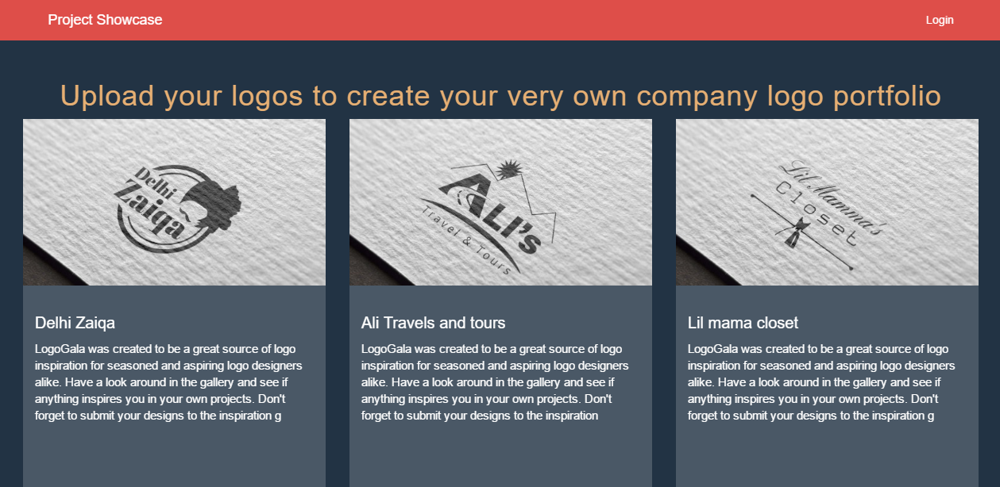

# Logo-Showcase
System to showcase all the Logo and Graphic work to client that you made till now on Laravel

Here is my first Update. You can login and register and create your own project, list down the project and eidt/delete the project from admin panel than on home page you can see all the list of your projects with ajax infinite scrolling so your website will never hang or make delay

You can Register new user by going to this link : www.url.com/register

<h1>Installation instructions:</h1>

1) download Git repo
2) make database in mysql name it to 'blog'
3) open cmd go to project directory
4) run command "php artisan migrate"
5) run command "php artisan serve"
6) Open up the browser and navigate to "localhost:8000" to see it in action

Which framework is used ?

LARAVEL 5.5

License

The Laravel logo showcase is open-sourced software licensed under the MIT license
 
 DEMO
 View the app here: http://www.conepoint.com/showcase/public/index.php